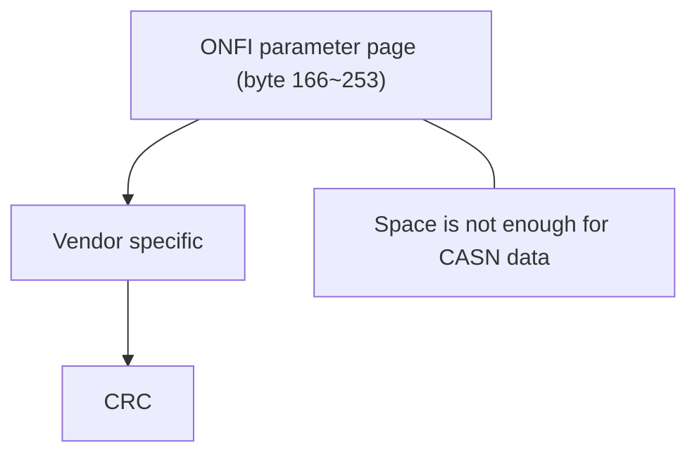

# CASN

CASN, i.e., Common Attributes for SPI-NAND, page is designed to fully describe SPI-NAND’s parameters so that the host controller can address it and get correct ECC information from it. It has the same CRC mechanism as ONFI parameter page. However, CASN page is more advantageous on:

1. CASN page provides critical information like

        1) Flash model name
        2) Plane number
        3) Does the SPI-NAND device contain Quad enable bit or not
        4) Does the SPI-NAND device support continuous read or not
        5) Read/Write command set

2. CASN page contains flash on-chip ECC information by each flash vendor so that host driver can transform them into
intuitive bitflip numbers and easily do wear-leveling.
3. We don’t need to maintain SPI-NAND flash table in host driver anymore.
4. Accelerate compatibility test of SoCs and SPI-NAND flashes: You can easily replace your SPI-NAND with any other CASN compatible devices.

Each CASN page copy is 256 bytes long. There’s three ways to integrate CASN page in current SPI-NAND design:

1. Add a brand-new command to read CASN page: With this, we can use a new 2KB or 4KB page to store CASN. However, there’s too much effort because flash manufacturers need to re-design command set and find another flash memory array to store CASN data.
2. Use the “Vendor Specific” field of ONFI parameter page (byte 166~253): Space is not enough for CASN data.

1. Use the rest space besides ONFI parameter page:

From above, we know the best option will be option 3. Flash manufacturers can integrate CASN page easily if directly attaching it to the space after parameter page. As a result, host driver uses the same command(13h) to read CASN page as how it reads parameter page, just with a difference row address. Therefore, we set OTP-E bit in status register 2 (mostly B0h) first and then issue read command(03h) with CASN page column address(300h). Table 1 describes how CASN page’s row address differs among manufacturers.

| Parameter/CASN Page Row Address | Manufactures |
| --- | --- |
| 00h | Etron |
| 01h | Dosilicon / ESMT /  Fidelix / Foresee / Fudan Micro / GigaSemi(GigaDevice) /  Kioxia / Macronix / Micron / Winbond |
| 181h | SkyHigh |

> Table 1 – CASN Page’s row address among manufactures

## Support

[ESMT]
F50L1G41LB
F50L2G41KA

[Etron]
EM73C044VCF-H
EM73D044VCO-H
EM73E044VCE-H
EM73F044VCA-H

[GigaDevice]
GD5F1GM7UE
GD5F1GQ5UEYIG
GD5F2GM7UE
GD5F2GQ5UEYIG
GD5F4GM8UE
GD5F4GQ6UEYIG

[Macronix (MXIC)]
MX35LF1GE4ABZ4IG

[Winbond]
W25N01GV
W25N01KV
W25N02KV
W25N04KV

A document of CASN is hosted on github(<https://github.com/mtk-openwrt/doc/blob/main/CASN%20Page%20Introduction.pdf>) So I'll try to keep it simple here.

With CASN page, we don't need to maintain SPI-NAND flash ID table anymore.
Currently, it's integrated in 3.3V SPI-NANDs of small density and it's not
JEDEC standard yet. But it should be able to handle 1.8V and can be easily
integrated by flash vendors.

## Other Documents

- [ESMT](https://www.esmt.com.tw/en/Products/Industrial%20Grade/SPI%20NAND-4-26)
- [Etron](https://etron.com/flash-pl/spi-nand-flash/)
- [GigaDevice](https://www.gigadevice.com/product/flash/spi-nand-flash/)
- [Macronix (MXIC)](https://www.mxic.com.tw/en-us/support/design-support/Pages/technical-document.aspx)
- [Winbond](https://www.winbond.com/hq/support/documentation/)
